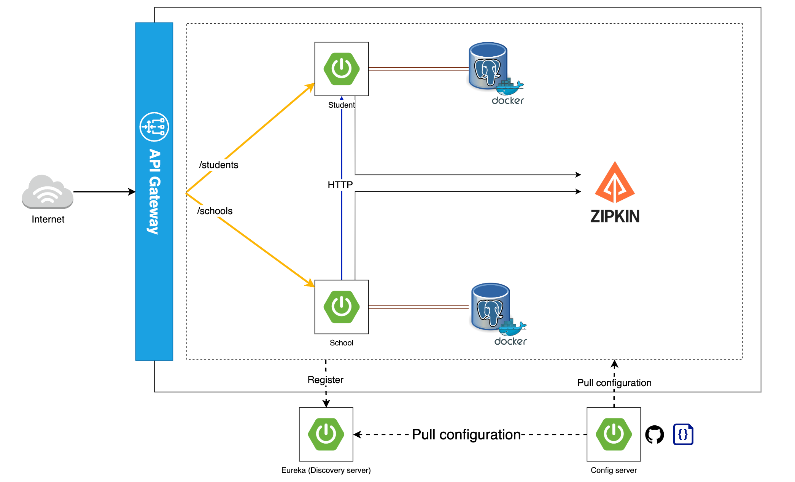

# Microservices Demo Project

## Description



This repository contains a demo project showcasing a microservices-based application, designed to provide a hands-on understanding of microservices architecture and implementation. The project consists of an API Gateway, Config Server, Discovery Server, and two microservices: Student and School.

## Table of Contents (Optional)
 
- [Getting Started](#getting-started)
   - [Technology](#technology)
   - [Installation](#installation)
- [Usage](#usage)
    - [API Gateway](#api-gateway)
    - [Config Server](#config-server)
    - [Discovery Server](#discovery-server)
    - [Student Microservice](#student-microservice)
    - [School Microservice](#school-microservice)
- [Inter-Service Communication](#inter-service-communication)
    - [Using OpenFeign](#using-openfeign)
- [Distributed Tracing](#distributed-tracing)
    - [Using Zipkin](#using-zipkin)
- [Contributing](#contributing)
- [License](#license)

## Getting Started

Follow the instructions below to set up the project on your local machine for development and testing purposes.

### Technology

- Java Development Kit (JDK) 17 or later
- Maven
- Docker (optional, for containerization)

### Installation

What are the steps required to install your project

1. Clone the repository

```
git clone https://github.com/txm-minh21/springboot-microservices.git
```

2. Navigate to the project directory
  
3. Build and package each component with Maven

## Usage

### API Gateway

The API Gateway serves as the single entry point for all client requests, managing and routing them to the appropriate microservices.

### Config Server

The Config Server centralizes configuration management for all microservices, simplifying application maintenance and consistency across environments.

### Discovery Server

The Discovery Server provides service registration and discovery, enabling seamless service-to-service communication within the microservices ecosystem.

### Student Microservice

The Student Microservice is responsible for managing student-related data and operations, such as adding, updating, and retrieving student records.

### School Microservice

The School Microservice manages school-related data and operations, including adding, updating, and retrieving school records.

## Inter-Service Communication

### Using OpenFeign

This project demonstrates inter-service communication using OpenFeign, a declarative REST client that simplifies service-to-service communication within the microservices ecosystem.

## Distributed Tracing

### Using Zipkin

The project showcases the use of Zipkin for distributed tracing, enhancing application observability and enabling the visualization and troubleshooting of latency issues.

## Contributing

Contributions are welcome! Please read our [CONTRIBUTING.md](CONTRIBUTING.md) for details on how to contribute to this project.

## License

This project is licensed under the [MIT License](LICENSE).

## Contact

[Create] - [Ali Bouali]

Project Link: https://github.com/ali-bouali/springboot-3-micro-service-demo
 
